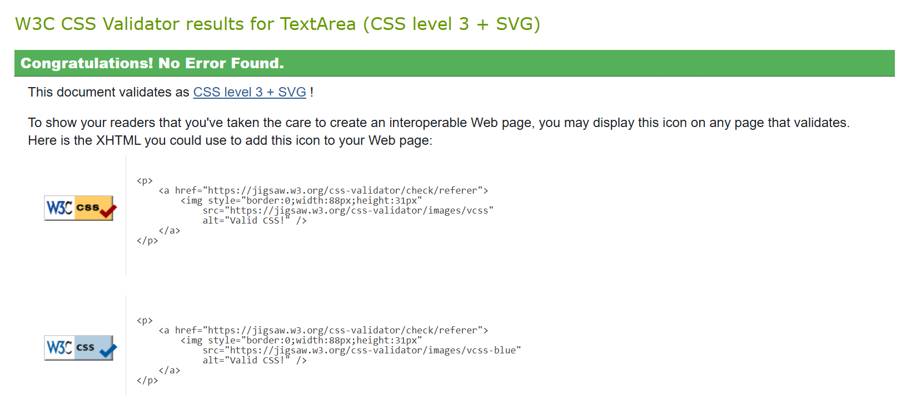
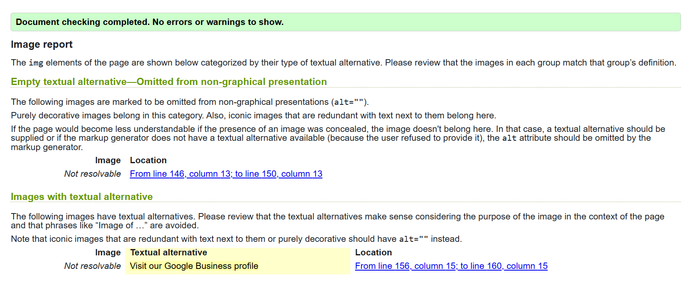
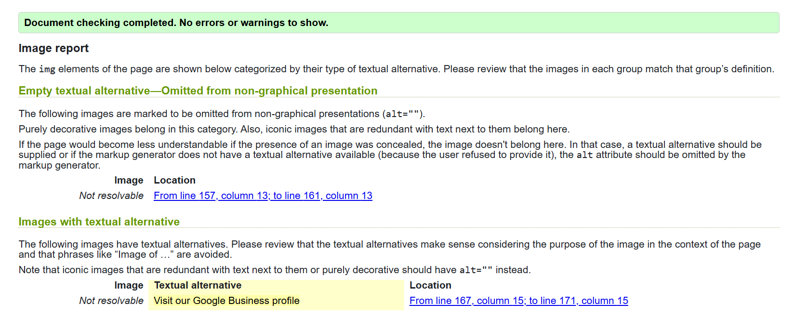
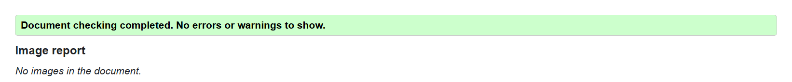
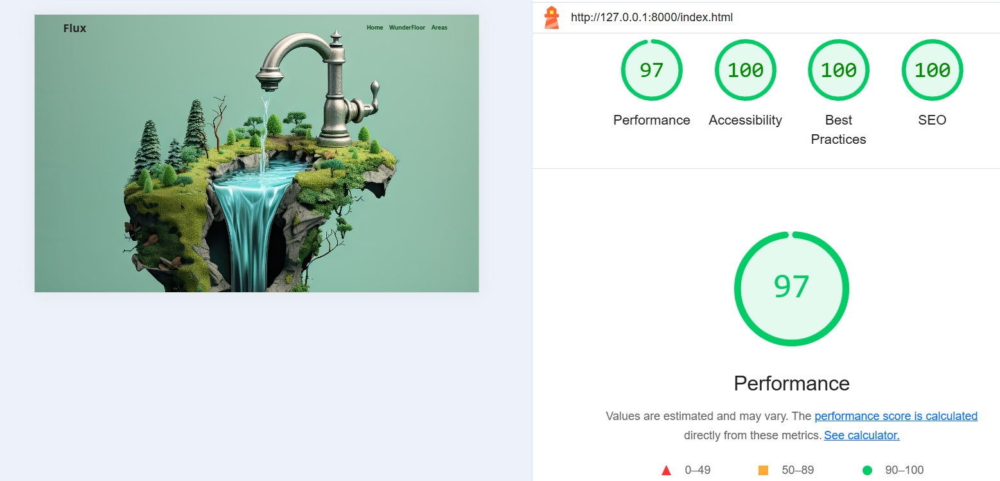
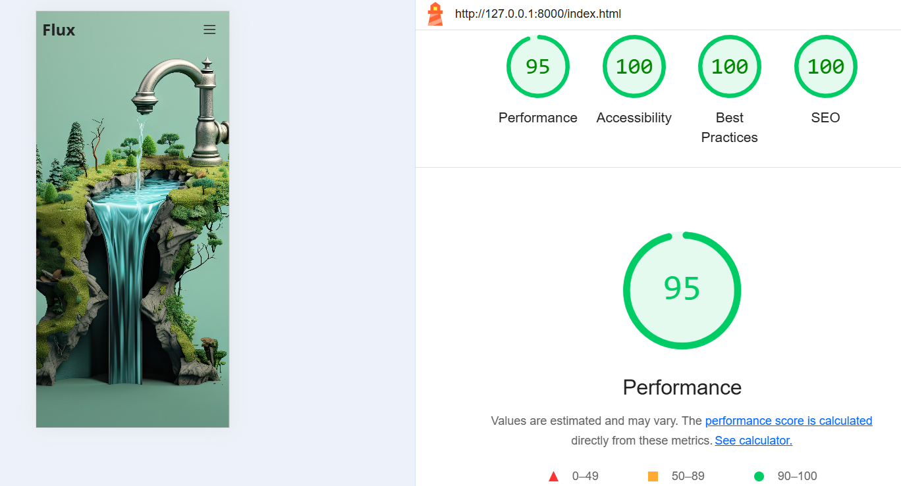
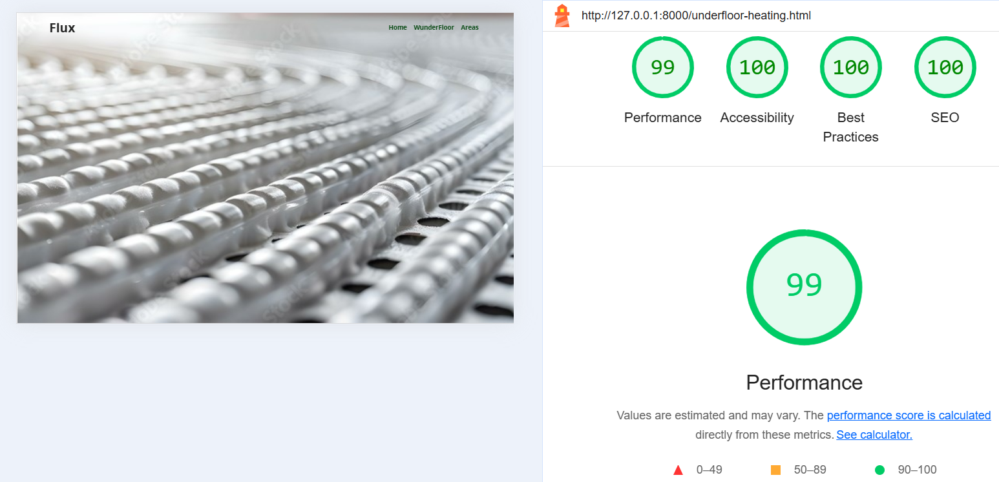
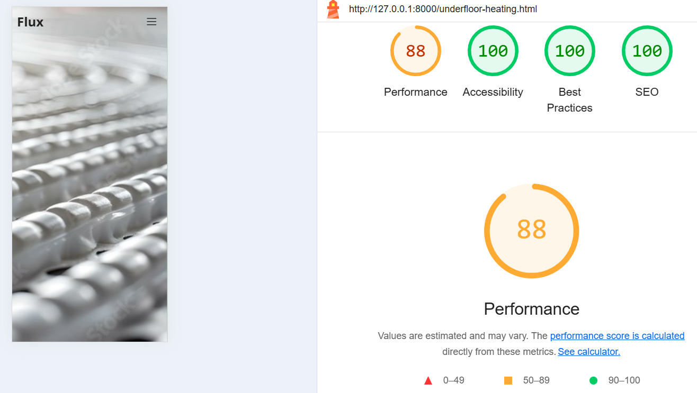
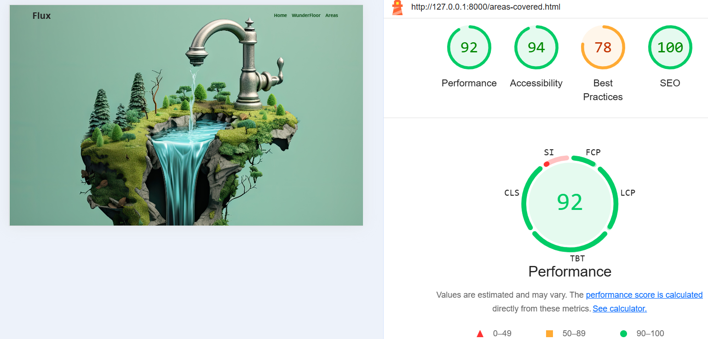
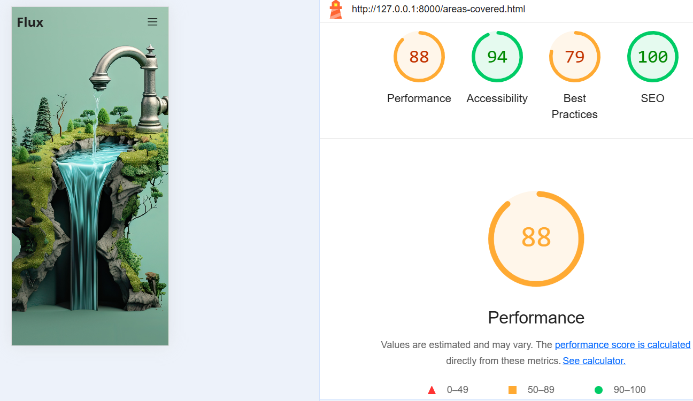

# TESTING.md: FLUX Testing

View Site -> FLUX | Bespoke Plumbing Services

CONTENTS

* [Automated Testing](#automated-testing)
    * [W3C CSS Validator](#w3c-css-validator)
    * [W3C HTML Validator](#w3c-html-validator)
        * [Index Page:](#index-page)
        * [WunderFloor Page:](#wunderfloor-page)
        * [Areas Page:](#areas-page)
* [Performance, Accessibility, Best Practices and SEO Testing](#performance-accessibility-best-practices-and-seo-testing)
    * [Home Page](#home-page)
    * [Wunderfloor Page](#wunderfloor-page)
    * [Areas Covered Page](#areas-covered-page)
* [Considerations for Improvements of Performance](#considerations-for-improvements-of-performance)
* [Steps Taken](#steps-taken-to-improve-performance)
* [Accessibility](#accessibility)
* [Best Practices](#best-practices)
    * [Third-Party Cookies:](#third-party-cookies)
* [SEO](#seo)

## Automated Testing

### W3C CSS Validator

Used [W3C Schools CSS validator](https://jigsaw.w3.org/css-validator/)

### W3C HTML validator

Used [W3C Nu HTML Checker](https://validator.w3.org/nu/)

**Index Page:**

**WunderFloor Page:**

**Areas Page:**

## Perfomance, Accessibility, Best Practices and CEO Testing

Used [Google Lighthouse](https://developers.google.com/speed/pagespeed/) for testing.

Scores are defined by Google as follows:

> source

Scores were obtained by running Lighthouse on Chrome Developer Tools on each page around 3 times for mobile and desktop, and the highest score was taken. From this, it is important to note that the Lighthouse score can vary each time you run the test; thus, it should be taken as a metric and not an absolute.

**Home Page**

- Desktop: 
- Mobile: 

**Wunderfloor Page**

- Desktop: 
- Mobile: 

**Areas Covered Page**

- Desktop: 
- Mobile: 

## Considerations for Improvements of Performance

Improvement could be made but would require a possible restructuring of the project or removing features that help the site stand out and is beyond the scope of the project. The following improvements could be considered if Lighthouse scores close to 100 on all tests were needed:

- **Bootstrap**: This is a 3rd party import and takes up load resources.
- **Google Fonts**: This is a 3rd party font library that takes up load resources.
  - Could be improved by establishing connections to these servers early in the page load process
- **Font Awesome**: This is a 3rd party icon library that takes up load resources.
  - Could be improved by establishing connections to these servers early in the page load process
- **High-Quality Images**: The use of high-quality images increases the time taken to download the page.
- Further optimisation could involve compressing these images, but this would reduce their quality, which is undesirable.

## Steps Taken to Improve Performance

The following steps were taken to improve performance:

- **Preconnect Optimisation**:
  - I have implemented the following preconnect links:
    - `<link rel="preconnect" href="https://cdn.jsdelivr.net" />`
      - This preconnect establishes an early connection to jsDelivr, a popular content delivery network (CDN). It allows the browser to initiate the connection process before discovering resources (like JavaScript files, CSS, or images) being loaded from jsDelivr. This can significantly reduce the time it takes to fetch these resources.
    - `<link rel="preconnect" href="https://fonts.googleapis.com" />`
      - This preconnect establishes an early connection to the server that serves the CSS and font files. It allows the browser to initiate the connection process (DNS lookup, TCP handshake, TLS negotiation) before the browser discovers the font resource in the HTML. This reduces latency when fetching the CSS.
    - `<link rel="preconnect" href="https://fonts.gstatic.com" crossorigin />`
      - This preconnect establishes an early connection to the server that actually delivers the font files. Because the CSS file from fonts.googleapis.com references font files on fonts.gstatic.com, preconnecting here can speed up font delivery. The `crossorigin` attribute is essential because Google Fonts serves its resources with CORS.
    - `<link rel="preconnect" href="https://cdnjs.cloudflare.com" />`
      - This preconnect establishes an early connection to Cloudflare's CDN. Like jsDelivr, Cloudflare hosts a variety of resources. Preconnecting can improve load times for CSS, JavaScript, and other assets.
    - `<link rel="preconnect" href="https://maps.googleapis.com" />`
      - This preconnect establishes an early connection to Google Maps API. It allows the browser to initiate the connection process before discovering resources (like JavaScript files, CSS, or images) required to display maps.
    - `<link rel="preconnect" href="https://maps.gstatic.com" crossorigin />`
      - This preconnect establishes an early connection to the server that delivers map tiles and data. The `crossorigin` attribute is needed because Google Maps serves some of its resources with CORS.
    - `<link rel="preload" href="https://cdn.jsdelivr.net/npm/bootstrap@5.3.3/dist/css/bootstrap.min.css" as="style" crossorigin="anonymous">`
      - This preload tells the browser to download the Bootstrap CSS file as early as possible during the page load. It identifies the resource as a stylesheet (`as="style"`) and `crossorigin="anonymous"` should be added for fetching resources from a different origin. This can significantly improve the time it takes for the browser to render the page, as it doesn't have to wait for the CSS to be discovered and downloaded later in the process.

## Accesibility

The accessibility is 100% throughout all the pages and sizes of both desktop and mobile devices.

## Best Practices

On the "Areas Covered" page, the integration of Google Maps involves the use of third-party cookies.

- **Third-Party Cookies:** Google Maps relies on third-party cookies for certain functionalities, such as tracking user interactions and preferences, and potentially for advertising purposes.
- **Impact:** The use of third-party cookies can raise privacy concerns, as these cookies allow Google to collect data about user behaviour across different websites, not just within our site.
- **Mitigation:**
  - It's important to be transparent with users about the use of Google Maps and its associated third-party cookies. This is typically addressed in the website's privacy policy.
  - While complete removal of third-party cookies related to Google Maps isn't feasible without removing the map functionality, we can:
    - Ensure the website has a clear and comprehensive privacy policy that informs users about the data collection practices of Google Maps.
    - Stay updated on the evolving privacy landscape and explore alternative mapping solutions or privacy-enhancing techniques if they become viable.
- **Context:** The "Areas Covered" page requires the use of Google Maps to display the locations we serve.

## SEO

The accessibility is 100% throughout all the pages and sizes of both desktop and mobile devices.
